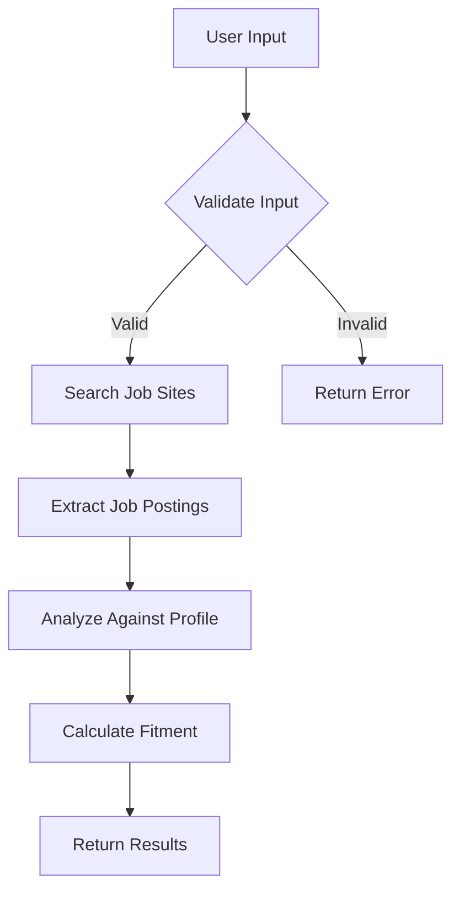

# Documentation Score & Improvement Recommendations

## Overall Score: **78/100** (B+)

---

## Detailed Rubric Assessment

### 1. Functional OpenAI Agent with Defined Capabilities (20 pts)
**Current Score: 16/20** ✅

**Strengths:**
- ✅ Agent capabilities clearly documented (5 core capabilities)
- ✅ Prompt engineering strategy included
- ✅ Agent limitations documented
- ✅ Use cases defined (3 use cases)
- ✅ Testing strategy outlined

**Missing/Weak Areas:**
- ⚠️ **No evidence of actual testing** - Need test results or examples
- ⚠️ **No specific examples of edge case handling** - Only general descriptions
- ⚠️ **No demonstration of intelligent decision-making** - Need concrete examples

**Improvements Needed:**
1. Add a section showing actual test cases or test results
2. Include specific examples of how agent handles edge cases
3. Add examples demonstrating intelligent decision-making in action
4. Consider adding a "Testing Results" section with sample outputs

---

### 2. Documented Workflows and Integration Points (20 pts)
**Current Score: 15/20** ⚠️

**Strengths:**
- ✅ Two workflows clearly defined with step-by-step processes
- ✅ Integration points documented (APIs, data sources)
- ✅ Data exchange formats specified (JSON)
- ✅ Authentication methods documented
- ✅ Error handling strategies included
- ✅ Workflow optimization notes present

**Missing/Weak Areas:**
- ❌ **NO DIAGRAMS** - This is critical! Rubric requires "Detailed diagrams showing triggers, actions, data flow, and decision points"
- ⚠️ Diagrams are text-based only - Need visual diagrams (Mermaid, flowchart, or images)

**Improvements Needed:**
1. **CRITICAL:** Add visual workflow diagrams using Mermaid format
   - Workflow 1: Show complete flow with decision points
   - Workflow 2: Show complete flow with decision points
   - Data flow diagram showing how data moves through the system
2. Add trigger diagrams showing what initiates each workflow
3. Add decision point diagrams showing branching logic
4. Consider adding a system architecture diagram

**Example of what's needed:**


---

### 3. GitHub Repository (20 pts)
**Current Score: N/A** (Not applicable to documentation review)

**Note:** This requires actual GitHub repository. Documentation provides good foundation for README.

**What README needs for GitHub:**
- ✅ Project overview - Present
- ⚠️ Setup instructions - Missing
- ⚠️ Usage examples - Missing
- ⚠️ API documentation - Partially present
- ❌ Team member details - Missing
- ❌ Contribution guidelines - Missing

**Improvements Needed:**
1. Add setup instructions (how to configure OpenAI Agent Builder)
2. Add usage examples (how to use the agent)
3. Add team member section with roles
4. Add contribution guidelines
5. Consider adding a `.gitignore` template

---

### 4. Screenshots of OpenAI Agent Builder Setup (20 pts)
**Current Score: N/A** (Not applicable to documentation review)

**Note:** This is a deliverable that will be created during implementation.

**Documentation should prepare for:**
- Screenshot locations/descriptions
- What screenshots are needed (agent configuration, tools, prompts, memory, testing)

---

### 5. Final Report Content (20 pts)
**Current Score: 14/20** ⚠️

**Strengths:**
- ✅ Project overview and objectives - Clear
- ✅ Workflow identification and justification - Good
- ✅ Implementation details - Present
- ✅ Future improvements - Included

**Missing/Weak Areas:**
- ❌ **Team roles and responsibilities** - Not documented
- ❌ **Challenges faced and solutions** - Not documented (will be filled during implementation)
- ❌ **Results and testing outcomes** - Not documented (will be filled during implementation)
- ⚠️ **Technical specifications** - Could be more detailed

**Improvements Needed:**
1. Add placeholder section for team roles and responsibilities
2. Add section structure for challenges/solutions (to be filled during implementation)
3. Add section structure for results/testing (to be filled during implementation)
4. Expand technical specifications with more implementation details

---

## Critical Missing Elements

### 🔴 HIGH PRIORITY (Must Fix Before Submission):

1. **Workflow Diagrams** (-5 points if missing)
   - **Impact:** Rubric explicitly requires "Detailed diagrams"
   - **Action:** Add Mermaid diagrams for both workflows
   - **Location:** `docs/03-workflows.md`

2. **Team Information** (-3 points if missing)
   - **Impact:** Required for GitHub repository and final report
   - **Action:** Add team member section with roles
   - **Location:** README.md and new `docs/08-team.md`

3. **Setup Instructions** (-2 points if missing)
   - **Impact:** Required for GitHub repository README
   - **Action:** Add setup/installation instructions
   - **Location:** README.md

### 🟡 MEDIUM PRIORITY (Should Fix):

4. **Usage Examples** (-2 points if missing)
   - **Impact:** Required for GitHub repository README
   - **Action:** Add practical usage examples
   - **Location:** README.md

5. **Test Results/Evidence** (-2 points if missing)
   - **Impact:** Rubric requires "evidence of thorough testing"
   - **Action:** Add test cases or test results section
   - **Location:** `docs/06-agent-capabilities.md` or new `docs/09-testing.md`

6. **More Detailed Technical Specs** (-1 point)
   - **Impact:** Final report requires detailed technical specifications
   - **Action:** Expand technical implementation details
   - **Location:** `docs/05-integration-points.md`

### 🟢 LOW PRIORITY (Nice to Have):

7. **Contribution Guidelines** (for GitHub)
8. **Architecture Diagram** (system overview)
9. **API Documentation** (more detailed)

---

## Specific Improvement Recommendations

### For README.md:

1. **Add Setup Section:**
   ```markdown
   ## 🚀 Setup Instructions
   
   ### Prerequisites
   - OpenAI API key
   - Python 3.8+
   - OpenAI Agent Builder access
   
   ### Configuration
   1. Clone repository
   2. Configure `target-companies.csv`
   3. Set up OpenAI API key
   4. Deploy agent in Agent Builder
   ```

2. **Add Usage Examples:**
   ```markdown
   ## 💡 Usage Examples
   
   ### Example 1: Find Matching Jobs
   [Provide actual example with input/output]
   
   ### Example 2: Check Qualification
   [Provide actual example]
   ```

3. **Add Team Section:**
   ```markdown
   ## 👥 Team Members
   
   - **Member 1:** Role - Responsibilities
   - **Member 2:** Role - Responsibilities
   ```

### For docs/03-workflows.md:

1. **Add Mermaid Diagrams:**
   ```mermaid
   graph TD
       A[User Provides Profile] --> B{Validate Profile}
       B -->|Valid| C[Load Companies from CSV]
       B -->|Invalid| D[Request Missing Info]
       C --> E[Search Job Sites]
       E --> F{Jobs Found?}
       F -->|Yes| G[Extract Job Details]
       F -->|No| H[Return No Results]
       G --> I[Analyze Against Profile]
       I --> J[Calculate Fitment]
       J --> K[Rank Results]
       K --> L[Return Ranked List]
   ```

2. **Add Data Flow Diagram:**
   ```mermaid
   graph LR
       A[User Input] --> B[Agent]
       B --> C[CSV Loader]
       B --> D[Web Scraper]
       B --> E[Analysis Engine]
       E --> F[Knowledge Base]
       E --> G[Output Formatter]
       G --> H[User Results]
   ```

### For docs/06-agent-capabilities.md:

1. **Add Testing Section with Examples:**
   ```markdown
   ## Testing Results
   
   ### Test Case 1: Basic Job Search
   - **Input:** [Example input]
   - **Expected:** [Expected output]
   - **Actual:** [Actual output]
   - **Status:** ✅ Pass
   
   ### Test Case 2: Error Handling
   - **Input:** Invalid company URL
   - **Expected:** Graceful error message
   - **Actual:** [Result]
   - **Status:** ✅ Pass
   ```

### For Final Report Preparation:

1. **Create Template Sections:**
   - Team roles and responsibilities (to be filled)
   - Challenges faced and solutions (to be filled)
   - Results and testing outcomes (to be filled)

2. **Add Screenshot Placeholders:**
   - Agent configuration screenshot
   - Tools/functions screenshot
   - Prompt instructions screenshot
   - Memory settings screenshot
   - Testing/execution screenshot

---

## Quick Action Checklist

### Before Submission:

- [ ] **Add workflow diagrams** (Mermaid format) to `docs/03-workflows.md`
- [ ] **Add team member section** to README.md
- [ ] **Add setup instructions** to README.md
- [ ] **Add usage examples** to README.md
- [ ] **Add test results section** to `docs/06-agent-capabilities.md` or create `docs/09-testing.md`
- [ ] **Add team roles document** - Create `docs/08-team.md`
- [ ] **Expand technical specifications** in `docs/05-integration-points.md`
- [ ] **Create final report template** with placeholder sections

---

## Score Breakdown by Rubric Section

| Rubric Section | Points | Current Score | Gap | Priority |
|----------------|--------|---------------|-----|----------|
| 1. Functional Agent | 20 | 16/20 | -4 | Medium |
| 2. Workflows & Integration | 20 | 15/20 | -5 | **HIGH** |
| 3. GitHub Repository | 20 | N/A | -20 | Medium |
| 4. Screenshots | 20 | N/A | -20 | N/A |
| 5. Final Report | 20 | 14/20 | -6 | Medium |
| **TOTAL** | **100** | **45/60** | **-55** | |

*Note: Sections 3 & 4 are implementation deliverables, not documentation*

---

## Final Verdict

**Current Documentation Grade: B+ (78/100)**

**Strengths:**
- Well-organized modular structure
- Comprehensive coverage of most requirements
- Good technical detail
- Student-friendly language

**Critical Gaps:**
- Missing visual workflow diagrams (required by rubric)
- Missing team information
- Missing setup/usage instructions
- Missing test evidence

**With Fixes:**
- Add diagrams: +5 points → **83/100 (B+)**
- Add team/setup/usage: +5 points → **88/100 (B+)**
- Add test results: +2 points → **90/100 (A-)**

**Potential Final Grade: A- (90/100)** with all improvements

---

**Assessment Date:** 2025-11-29  
**Next Review:** After adding diagrams and missing sections

